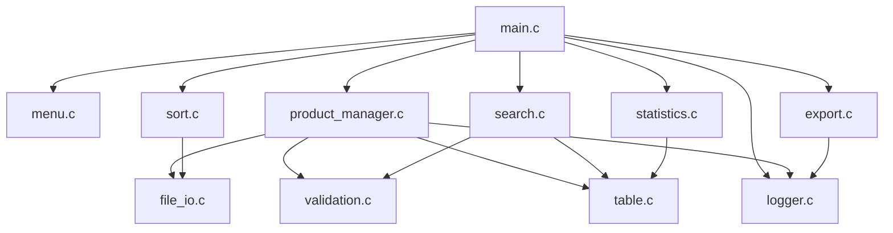

[LINK GITHUB: https://github.com/chung1504/product-management.git]

# 📘 Tài liệu dự án — Product Management System (Array Version)

Tài liệu này giúp hiểu nhanh: dự án có bao nhiêu file, mỗi file làm gì, và các module liên hệ với nhau như thế nào.

---

## 1. Thông tin chung

| Mục | Nội dung |
|---|---|
| Ngôn ngữ | C |
| Cách lưu trữ chính | File nhị phân `data.bin` (đọc/ghi bằng `fread`/`fwrite`) |
| Hỗ trợ xuất dữ liệu | `.txt`, `.csv`, `.sql` (SQLite) |
| Kiểu cấu trúc dữ liệu | Mảng tĩnh (Array), giới hạn `MAX_PRODUCTS` |
| Tổng số file mã nguồn | 11 file `.c` + 11 file `.h` tương ứng |

---

## 2. Cấu trúc thư mục

```
Array/
├── Makefile
├── data/           → data.bin, products.csv, products.sql, logger.txt
├── docs/           → README.md
├── include/        → 11 file .h (khai báo hàm/struct)
└── src/            → 11 file .c (cài đặt logic)
```

---

## 3. Mô tả từng file `.c`

| File | Vai trò | Hàm chính |
|---|---|---|
| `main.c` | Điểm khởi đầu, vòng lặp menu chính | `main()` |
| `menu.c` | Hiển thị menu, xoá màn hình | `showMainMenu()`, `clearScreen()` |
| `validation.c` | Nhập & kiểm tra dữ liệu đầu vào an toàn | `inputInt()`, `inputFloat()`, `inputString()`, `confirmYesNo()`, `isIdExists()` |
| `product_manager.c` | Nghiệp vụ CRUD: thêm/sửa/xoá/chèn | `menuWriteProducts()`, `menuAppendProducts()`, `menuReadProducts()`, `menuModifyProducts()`, `menuInsertProduct()`, `menuDeleteProduct()` |
| `file_io.c` | Đọc/ghi mảng sản phẩm xuống file `.bin` | `loadProductsFromFile()`, `saveProductsToFile()` |
| `search.c` | Tìm kiếm theo ID / tên / giá / số lượng | `menuSearchProduct()` |
| `sort.c` | Sắp xếp theo trường (selection sort) | `menuSortProducts()` |
| `statistics.c` | Thống kê: tổng SP, tổng tồn kho, giá cao/thấp, TB, tổng giá trị | `menuStatisticsProduct()` |
| `export.c` | Xuất dữ liệu ra TXT / CSV / SQL | `menuExportProducts()` |
| `table.c` | Vẽ bảng dữ liệu ra console (căn cột tự động) | `printProductTable()` |
| `logger.c` | Ghi log các thao tác quan trọng, xem log | `writeLog()`, `viewLogs()` |

---

## 4. Sơ đồ module (tổng quan, không đi sâu chi tiết hàm)



**Cách đọc:** `main.c` gọi tới các module nghiệp vụ (menu chức năng). Các module này lại dùng chung `validation.c` (nhập liệu), `table.c` (in bảng), `file_io.c` (lưu file) và `logger.c` (ghi log).

---
