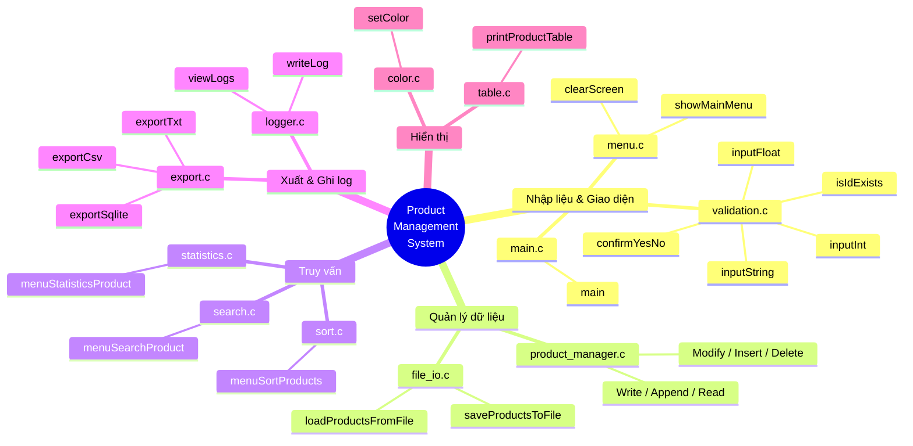

# 🗺️ Sơ đồ tổng quan File & Hàm — Product Management System

Sơ đồ dạng **mindmap** (toả từ giữa ra, phát triển theo chiều dọc) — nhìn tổng quan được ngay, không cần zoom hay kéo ngang.

---

## 📋 Bảng chi tiết (đọc kèm khi cần)

| Nhóm | File | Hàm chính |
|---|---|---|
| Nhập liệu & Giao diện | `main.c` | `main()` |
| | `menu.c` | `showMainMenu()`, `clearScreen()` |
| | `validation.c` | `inputInt()`, `inputFloat()`, `inputString()`, `confirmYesNo()`, `clearInputBuffer()`, `isIdExists()` |
| Quản lý dữ liệu | `product_manager.c` | `menuWriteProducts()`, `menuAppendProducts()`, `menuReadProducts()`, `menuModifyProducts()`, `menuInsertProduct()`, `menuDeleteProduct()` (+ 4 hàm `static` nội bộ) |
| | `file_io.c` | `loadProductsFromFile()`, `saveProductsToFile()` |
| Truy vấn | `search.c` | `menuSearchProduct()` (+ 8 hàm `static` xử lý bên trong) |
| | `sort.c` | `menuSortProducts()` (+ 2 hàm `static`) |
| | `statistics.c` | `menuStatisticsProduct()` (+ 6 hàm `static`) |
| Xuất & Ghi log | `export.c` | `exportTxt()`, `exportSqlite()`, `menuExportProducts()` (+ `exportCsv` static) |
| | `logger.c` | `writeLog()`, `viewLogs()` |
| Hiển thị | `table.c` | `printProductTable()` (+ `printSeparator` static) |
| | `color.c` | `setColor()` |

---

## 📌 Ghi chú

- Nhóm theo **chức năng** (5 nhóm) chứ không theo alphabet, giúp nhìn vào biết ngay module nào thuộc mảng nào.
- Muốn xem đầy đủ tên + tham số từng hàm (bao gồm cả hàm `static`) → xem file `TAI_LIEU_CHI_TIET.md`.