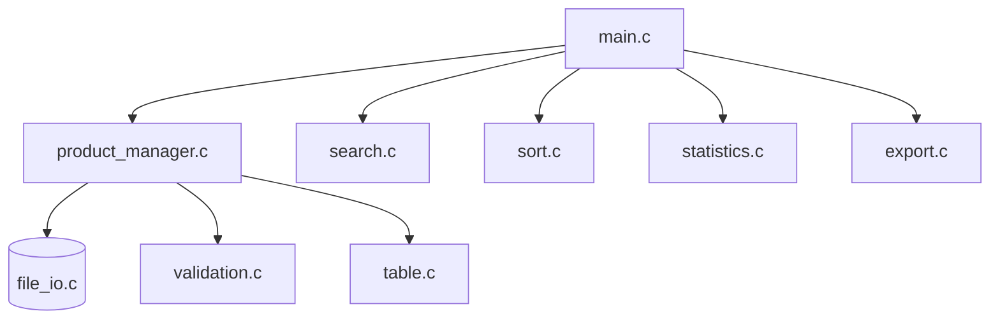

# 📦 Product Management System — C (Array Version)


Chương trình quản lý sản phẩm chạy trên console, viết bằng C chuẩn C89/C90, sử dụng **mảng tĩnh (Array)** để lưu dữ liệu trong bộ nhớ và **file nhị phân** để lưu trữ lâu dài. Đây là bài tập môn **PRF192 – Programming Fundamentals** (FPT University).

---

## ✨ Tính năng

- ➕ Thêm / nhập mới sản phẩm (ghi đè hoặc append)
- 📖 Xem danh sách sản phẩm (có phân trang)
- ✏️ Sửa thông tin sản phẩm theo ID
- 📥 Chèn sản phẩm vào vị trí bất kỳ
- 🗑️ Xoá theo ID hoặc xoá toàn bộ
- 🔍 Tìm kiếm theo ID / tên / giá / số lượng
- ↕️ Sắp xếp theo ID, tên, giá, số lượng (tăng/giảm)
- 📊 Thống kê: tổng số sản phẩm, tổng tồn kho, giá cao/thấp nhất, giá trung bình, tổng giá trị
- 📤 Xuất dữ liệu ra `.txt`, `.csv`, `.sql`
- 🧾 Ghi log & xem lại lịch sử thao tác

---

## 🗂 Cấu trúc dự án

```
Array/
├── Makefile
├── data/               # data.bin, products.csv, products.sql, logger.txt
├── docs/                # Tài liệu bổ sung
├── include/             # File khai báo (.h)
└── src/                 # File cài đặt (.c)
    ├── main.c
    ├── menu.c
    ├── validation.c
    ├── product_manager.c
    ├── file_io.c
    ├── search.c
    ├── sort.c
    ├── statistics.c
    ├── export.c
    ├── table.c
    └── logger.c
```

---

## 🧩 Sơ đồ tổng quan



---

## ⚙️ Yêu cầu

- Compiler hỗ trợ chuẩn C89/C90 (GCC / MinGW)
- `make` để build qua Makefile

## 🚀 Cài đặt & Chạy

```bash
# Clone project
git clone https://github.com/<username>/<repo-name>.git
cd Array

# Build
make

# Chạy chương trình
./management_product_console      # Linux/macOS
management_product_console.exe    # Windows
```

---

## 🛠 Công nghệ sử dụng

- **C89/C90** — logic nghiệp vụ chính
- **Binary File I/O** — lưu trữ dữ liệu sản phẩm
- **SQLite (export)** — xuất dữ liệu sang định dạng `.sql`

---

## 👤 Author

**chungtapcode** — Sinh viên FPT University, chuyên ngành Kỹ thuật phần mềm.

## 📄 License

Dự án phục vụ mục đích học tập (PRF192 — FPT University).
